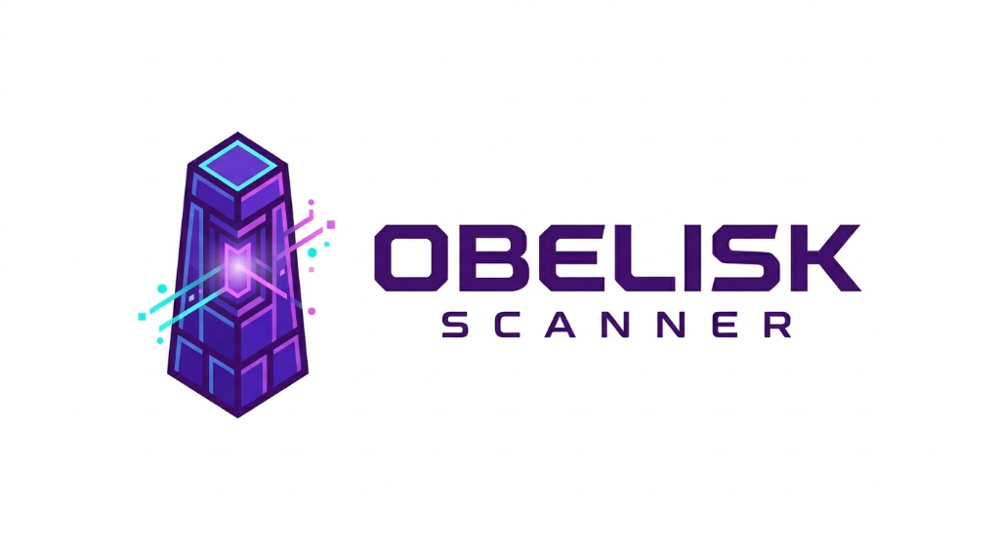

#

# OBELISK SCANNER
> **The Industrial-Grade Vulnerability Intelligence Platform.**

OBELISK SCANNER is a high-performance, Brutalist-style security tool designed for rapid vulnerability mapping. It combines deep dependency auditing with protocol-aware live target fingerprinting, delivering high-contrast, actionable intelligence in the terminal and professional reports.

## Key Features

- **Pillar-Grade Auditing**: Scan requirements.txt, local directories, or specific packages across PyPI and more.
- **Live Fingerprinting**: Identify technologies and CVEs in real-time from URLs or IP addresses.
- **Monolith Reporting**: Export professional, purple-branded reports in **PDF**, **HTML**, **JSON**, and **CSV**.
- **Brutalist CLI**: A terminal interface designed for speed, clarity, and glowing aesthetics.

## Installation

OBELISK SCANNER is easy to install and deploy:

```bash
git clone https://github.com/user/obelisk-scanner
cd obelisk-scanner
pip install .
```

*Requires Python 3.8+*

## Usage

```text
usage: obeliskscan scan [-h]
                        [-f FILE | -d DIR | --package PKG | --target URL/IP]
                        [--target-ports PORTS]
                        [--severity {CRITICAL,HIGH,MEDIUM,LOW,ALL}]
                        [--ignore CVE_IDS] [--cve CVE_ID] [--limit N]
                        [--format FMT] [--output-dir DIR] [--timeout SEC]
                        [--insecure] [--no-color] [--verbose] [--ci]
                        [--no-export]

options:
  -h, --help            show this help message and exit
  -f FILE, --file FILE
  -d DIR, --dir DIR
  --package PKG
  --target URL/IP
  --target-ports PORTS
  --severity {CRITICAL,HIGH,MEDIUM,LOW,ALL}
  --ignore CVE_IDS
  --cve CVE_ID
  --limit N
  --format FMT          Export formats (comma-separated: html,pdf,json,csv).
                        If omitted, you will be prompted.
  --output-dir DIR
  --timeout SEC
  --insecure            Disable TLS certificate verification (not
                        recommended).
  --no-color
  --verbose
  --ci
  --no-export

----------------------------------------------------
  EXAMPLES
----------------------------------------------------

  Scan a requirements.txt:
    obeliskscan scan -f requirements.txt

  Scan a project directory:
    obeliskscan scan -d ./myproject

  Scan a specific package inline:
    obeliskscan scan --package requests==2.27.0

  Scan a live target (URL/IP) for CVEs via HTTP/port fingerprinting:
    obeliskscan scan --target scanme.nmap.org
    obeliskscan scan --target https://example.com --target-ports 80,443,22
----------------------------------------------------
```

## License & Disclaimer
Distributed under the **MIT License**. For educational and professional security auditing purposes only. Use responsibly on authorized targets.

---
© 2026 OBELISK SCANNER
